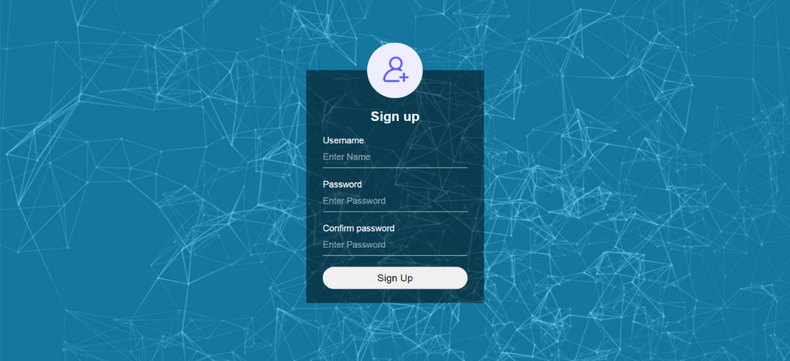
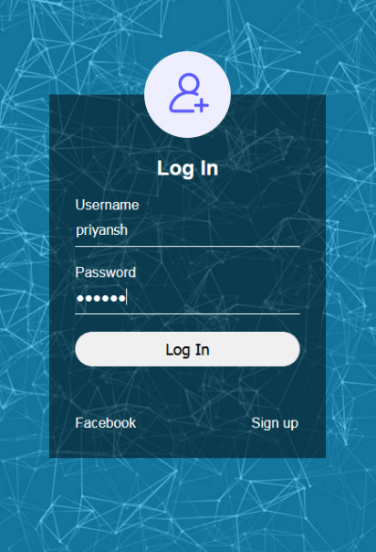

# JOB-PORTAL
A website for job portal
# Features
This website includes jobs of different categories like bsc, msc etc.
# Registration and Login
This is a registration page

This is a login page

# Requirements
XAMPP , php 7 my sql and a browser of your choice
# Steps
* Download all the folders
* open index.html
* For testing database open XAMPP control panel and start PHP and MY SQL
* Create database as registerdb and table name as sysusers of 4 columns and named as id, username, password, created_at.
* For testing register open register.php. After registration the site will ask for login and then you can test front-end functions.
